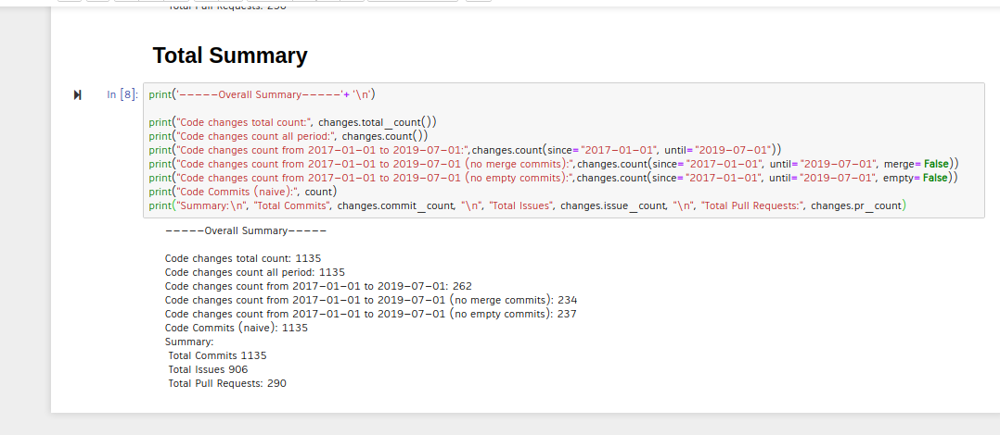

## Microtask 0

Produce a notebook which collects the data of a project, retrieved by Perceval, and show a summary of contents of the file.

## Solution

[Link to the Notebook](microtask-0.ipynb)



## Explanation

1. First step in this microtask is to get the data by using the Perceval module.

For retreiving the commit data

```bash
$ perceval git --json-line https://github.com/elastic/elasticsearch-py >> elasticsearch-py.json
```
For retreiving the issues data

```bash
$ perceval github elastic elasticsearch-py --sleep-for-rate -t xxxx --category issue >> elasticsearch-py.json
```
For retreiving the pull_requests data

```bash
$ perceval github elastic elasticsearch-py --sleep-for-rate -t xxxx --category pull_request >> elasticsearch-py.json
```

And I need to download the data of five such projects, so I automated this procedure by writing a small shell script [sh.sh](../sh.sh). All you need to do is to add your GITHUB_TOKEN in the shell file and run it.
```bash
$ ./sh.sh
```
2. I wrote a script which took samples of each different line available in the data source, like commit, issue and pull_request. I formatted the code which made me undertand the json structure of the lines. The json structure of the commit line is different whereas the issue and pul_request are same. Each line has a `category` field which tells whether the line is a commit/issue/pull_request.

commit line structure looked like this
```
{
   "backend_name": "Git",
   "backend_version": "0.10.2",
   "category": "commit",
   "data": {
      "Author": "Honza Kral <honza.kral@gmail.com>",
      "AuthorDate": "Wed May 1 16:37:32 2013 +0200",
      "Commit": "Honza Kral <honza.kral@gmail.com>",
      "CommitDate": "Wed May 1 16:39:30 2013 +0200",
      "commit": "20fbba1230cabbc0f4644f917c6c2be52b8a63e8",
      "files": [
         {
            "action": "A",
            "added": "5",
            ...
            ...
            "modes": [
               "000000",
               "100644"
            ],
            "removed": "0"
         }
      ],
      "message": "Initial commit, simple python scaffold",
      "parents": [],
      "refs": []
   },
   "origin": "https://github.com/elastic/elasticsearch-py",
   "perceval_version": "0.12.5",
   "tag": "https://github.com/elastic/elasticsearch-py",
   "timestamp": 1.55181798E9,
   "updated_on": 1.36741914E9,
   "uuid": "62577f96d2b7c41f970b66735085567cd1e38e76"
}
```
issue/pull_request line structure looked like this
```
{
   "backend_name": "GitHub",
   "backend_version": "0.18.0",
   "category": "issue",
   "data": {
      "assignee": null,
      "assignee_data": {},
      "assignees": [],
      "assignees_data": [],
      "author_association": "NONE",
      "body": "Requiring requests==1.2.0 conflicts with other packages.  As a library, it should really be more tolerable of versions and not require a precise release.\n",
      "closed_at": "2013-09-25T09:03:00Z",
      ...
      ...
      "updated_at": "2013-09-25T09:03:00Z",
      "url": "https://api.github.com/repos/elastic/elasticsearch-py/issues/2",
      "user": {
         "avatar_url": "https://avatars3.githubusercontent.com/u/1234915?v=4",
         "events_url": "https://api.github.com/users/kevinastone/events{/privacy}",
         ...
         ...
         "url": "https://api.github.com/users/kevinastone"
      },
      "user_data": {
         "avatar_url": "https://avatars3.githubusercontent.com/u/1234915?v=4",
         "bio": null,
         "blog": "http://blog.kevinastone.com",
         ...
         ...
         "url": "https://api.github.com/users/kevinastone"
      }
   },
   "origin": "https://github.com/elastic/elasticsearch-py",
   "perceval_version": "0.12.5",
   "tag": "https://github.com/elastic/elasticsearch-py",
   "timestamp": 1.55181862E9,
   "updated_on": 1.38009984E9,
   "uuid": "b4b0307ef194538dd05a5868bb6c6d629688a6c7"
}
```

3. Now that I have understood the basic structure and the [existing code](https://github.com/chaoss/wg-gmd/blob/master/implementations/Code_Changes-Git.ipynb), I started writing the code for getting the data, by extracting the (key, value) pair.

4. The TimeStamp can be retrieved by extracting the value of the `timestamp` key in the json structure and converting it into readable date format.

>   "timestamp": 1.55181862E9,

_Reference_: [Stack Overflow](https://stackoverflow.com/questions/3682748/converting-unix-timestamp-string-to-readable-date)

5. The repository retrieved can be found by extracting the value of `origin`  key.

>    "origin": "https://github.com/elastic/elasticsearch-py",

6. Then I have written code showing the results of the microtask-0.