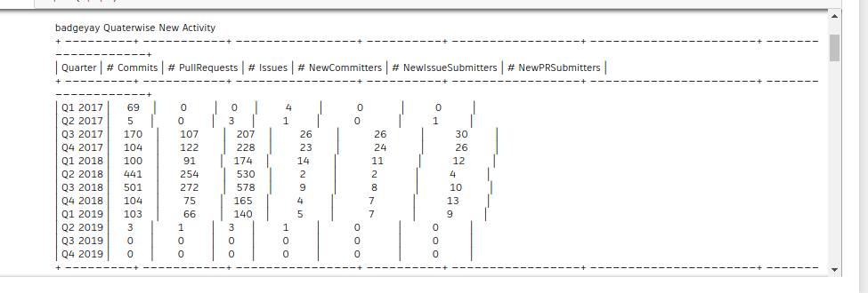

## Microtask 1

Produce a notebook showing (and producing) a list with the activity per quarter: number of new committers, submitters of issues, and submitters of pull/merge requests, number of items (commits, issues, pull/merge requests), number of repositories with new items (all of this per quarter) as a table and as a CSV file using plain python3 (no pandas).

## Solution

[Link to the Notebook](microtask-1.ipynb)

CSV file: [elasticsearch-py.csv](elasticsearch-py.csv)

## Explanation

1. The first step was to collect the contents of the repository. I used the data source and checked for the different contribution types, commit/issue/pull_request. I check for the contribution type and wrote function according to that which would get me the contents. As we saw in the [last microtask](https://github.com/vchrombie/chaoss-microtasks/tree/master/microtask-0) that the commit has a different json structure but issue and pull_request has almost the same (atleast when you consider few things like `created_at`, `hash`, `author`). So, I wrote one function for issue/pr and one for commit.

2. The next step was to define the quarters.

The calendar year can be divided into four quarters, often abbreviated as Q1, Q2, Q3, and Q4.
- First quarter, Q1: 1 January – 31 March (90 days or 91 days in leap years)
- Second quarter, Q2: 1 April – 30 June (91 days)
- Third quarter, Q3: 1 July – 30 September (92 days)
- Fourth quarter, Q4: 1 October – 31 December (92 days)

Reference: https://en.wikipedia.org/wiki/Calendar_year

3. The next step was to get the starting date and ending date of the project. I did this using requests module. I got the contents by sending a api request to github about the repository. It returned a json object which has two keys, `created_at`  and `updated_at` . This information is reagarding the repository not commit or issue. The years in the value of the two keys gives you the year in which project was created and the current year respectively.

4. Then I wrote a function which creates this quarters by getting the start year of the project and current year and making buckets of quarters which has a start and end.

5. The next step is to divide the contributions into quaterly basis by checking whether the contribution `created_at`  falls in which quarter and I made seperate track recordings of commit,issue,pull_request by using defaultdict. The count of the commit/issue/pr is stored in activities defaultdict. The `author`  of the commit/issue/pr is also checked continously where we have a set of oldcontributors (to avoid duplicates) and we have a list of newcontributors to add a author is he is not in oldcontributors.

6. I wrote functions to show the commits/issues/prs before making them into a csv/table. I wrote another function to display the count of new contributors. These two are basically iterating over a defaultdict which will give you the required results.

7. The next function is to convert the data into csv file by writing the data as rows into the csv file using the zip function which i used to map the similar index of multiple containers so that they can be added in single entity, here it is rows.

8. The next function is to print a table using the csv file. I have used a [prettytable](https://github.com/jazzband/prettytable) module which pretty prints a csv file as a table. 