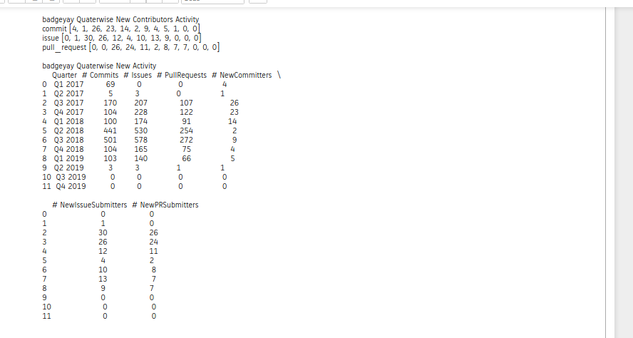

## Microtask 2

Same as [microtask-1](https://github.com/vchrombie/chaoss-microtasks/microtask-1), but now using [pandas](http://pandas.pydata.org/).

## Solution

[Link to the Notebook](microtask-2.ipynb)

CSV files: [csv_files/badgeyay.csv](csv_files/badgeyay.csv)

## Explanation

The first 5 steps are same as the [previous microtask](https://github.com/vchrombie/chaoss-microtasks/tree/master/microtask-1). We will be using pandas in this microtask. The contents of the repository commits/issues/prs are stored in the contents dataframe which will be directly. Using pandas, things are pretty simple as I have the power to operate on columns directly.

5. The contributions are divided into quarters by checking the `created_at`  date to fall in between the start and end of that quarter and then categorize the quarter. The oldcontributors are updated using the set function to avoid duplicates. The newcontributors are filtered by using the oldcontributors set by checking whether they are already contributed to the org. The activities are are filtered using the has of the commit/issue/pull_request.

6. Later, I made a dataframe to store all these data and converted it to csv and printed it as table using pandas library.