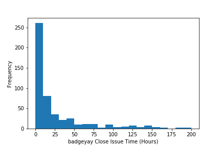
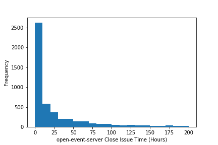
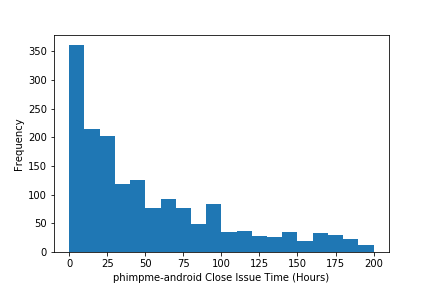
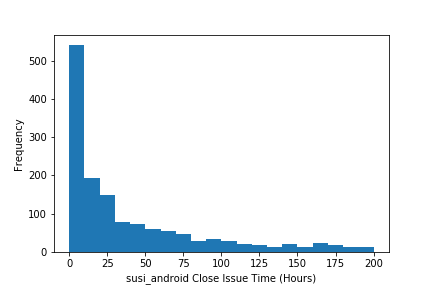
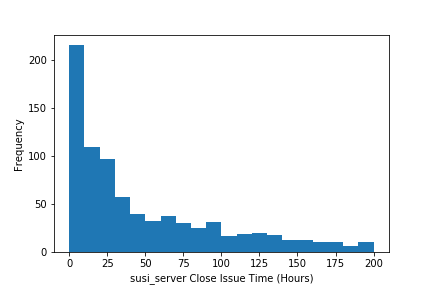

## Microtask 3

Produce a notebook with charts showing the distribution of time-to-close for issues already closed, and opened during the last year, for each of the repositories analyzed, and for all of them together. Use Pandas for this, and the Python charting library of your choice (as long as it is a FOSS module).

## Solution

[Link to the Notebook](https://github.com/vchrombie/chaoss-microtasks/blob/master/microtask-3/microtask-3.ipynb)

| Repository | Chart |
| --- | --- |
| [badgeyay](https://github.com/fossasia/badgeyay) |  |
| [open-event-server](https://github.com/fossasia/open-event-server) |  |
| [phimpme-android](https://github.com/fossasia/phimpme-android) |  |
| [susi_android](https://github.com/fossasia/susi_android) |  |
| [susi_server](https://github.com/fossasia/susi_server) |  |

## Explanation