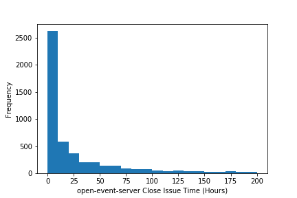
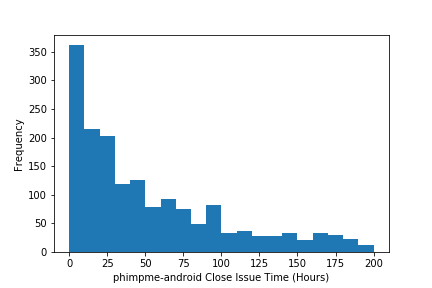
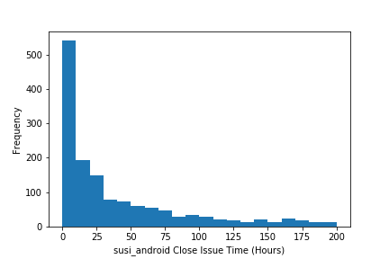
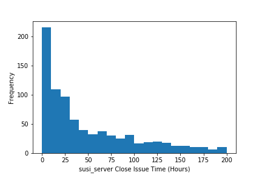

## Microtask 3

Produce a notebook with charts showing the distribution of time-to-close for issues already closed, and opened during the last year, for each of the repositories analyzed, and for all of them together. Use Pandas for this, and the Python charting library of your choice (as long as it is a FOSS module).

**NOTE**: I have two files in each microtask folder, `microtask-#-online.ipynb` which uses elastic projects and `microtask-#.ipynb` which uses FOSSASIA projects as data source. If you are checking the code in MyBinder, I suggest you to open `microtask-#-online.ipynb` file as you can run the code. If you are opening in GitHub web interface, I suggest you to open `microtask-#.ipynb` so that you can see the analysis of 5 repositories.

## Solution

[Link to the Notebook](microtask-3.ipynb)

| Repository | Chart |
| --- | --- |
| [fossasia/badgeyay](https://github.com/fossasia/badgeyay) |  |
| [fossasia/open-event-server](https://github.com/fossasia/open-event-server) |  |
| [fossasia/phimpme-android](https://github.com/fossasia/phimpme-android) |  |
| [fossasia/susi_android](https://github.com/fossasia/susi_android) |  |
| [fossasia/susi_server](https://github.com/fossasia/susi_server) |  |

## Explanation

1. The first step is to get the contents of the repository. As we are concerned about the issues, we are getting the data of only the issues using the summerize_issue function. I stored the data in contents dataframe. The data includes `created_date` and ` closed_date`. 
 
2. Calculated the closing time of an issue by subtracting the `created_date` and ` closed_date`. Th close_time is plotted against the frequency in histogram plot using the matplotlib library.