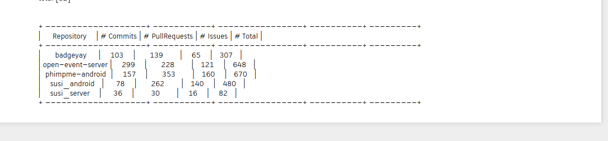

## Microtask 4

Produce a listing of repositories, as a table and as CSV file, with the number of commits authored, issues opened, and pull/merge requests opened, during the last three months, ordered by the total number (commits plus issues plus pull requests). Use plain Python3 (eg, no Pandas) for this.

**NOTE**: I have two files in each microtask folder, `microtask-#-online.ipynb` which uses elastic projects and `microtask-#.ipynb` which uses FOSSASIA projects as data source. If you are checking the code in MyBinder, I suggest you to open `microtask-#-online.ipynb` file as you can run the code. If you are opening in GitHub web interface, I suggest you to open `microtask-#.ipynb` so that you can see the analysis of 5 repositories.

## Solution

[Link to the Notebook](microtask-4.ipynb)

CSV file: [results-fossasia.csv](results-fossasia.csv)

## Explanation

1. The first step is to get the contents of the repository like the commit/issue/pull_request details using the function defined in the previous microtasks.

2. Then I defined the initial_date which is the date exactly before three months using datetime library.
> Reference: https://stackoverflow.com/a/546356/8268998

3. Then I checked if the commit/issue/pr is within the three months of time and update the counter accordingly. The total counter (commits+issues+pull_requests) is also maintained and all these counters are stored in a repodata defaultdict.

4. The data is then written to a csv file and printed as a table.