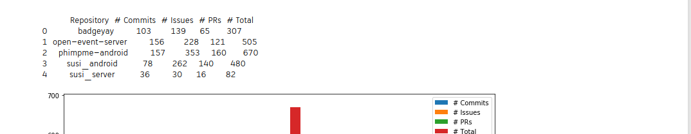
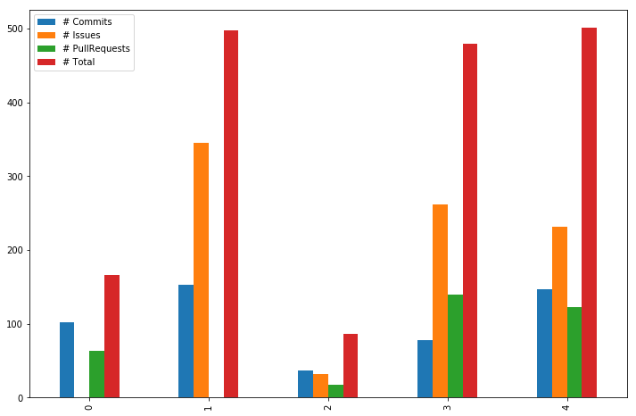

## Microtask 5

Same as [microtask-4](https://github.com/vchrombie/chaoss-microtasks#microtask-4), but now using [pandas](http://pandas.pydata.org/).

## Solution

[Link to the Notebook](microtask-5.ipynb)

CSV file: [results.csv](results.csv)

## Explanation

1. The first step is to get the contents of the repository like the commit/issue/pull_request details using the function defined in the previous microtasks.

2. Then I defined the initial_date which is the date exactly before three months using datetime library.
> Reference: https://stackoverflow.com/a/546356/8268998

3. Then I formatted the date according to the suitable format and checked if the commit/issue/pr is within the three months of time and update the counter accordingly. The total counter (commits+issues+pull_requests) is also maintained and all these counters are stored in a dataframe.

4. The data in the dataframe is then written to a csv file and printed as a table using pandas.